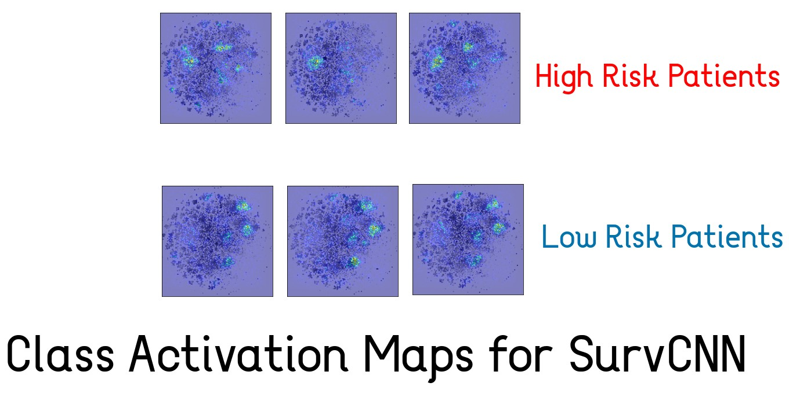

# survival_cams [Google COLAB]

## Class activation maps for high risk and low risk patients in lung adenocarcinoma
#### For the survival analysis code please see: https://github.com/TeamSundar/SurvCNN
#### For converting gene expression data to image please see: https://github.com/xinformatics/deepinsight_py
#### StringDB https://string-db.org/

#### The following analysis is based on a manuscript under communication. This class activation analysis is a separate work.

## Analysis of the CAMS
### Low Risk Patient [3 Prominent Clusters, anazlyzed using stringDB]

### Cluster 1

### Cluster 2

### Cluster 3

### High Risk Patient [2 Prominent Clusters, anazlyzed using stringDB]

### Cluster 1

### Cluster 2

## This analysis shows that the algorithm which converts expression values to images works and the results are not random. Genes which do interact in cells are clustered together in the images by the algorithm. 

## Use of Activation MAPS finds signatures in the image which decides the risk of the patient. These signatures are not random, enrichment analysis marks these genes in cancer pathways.
